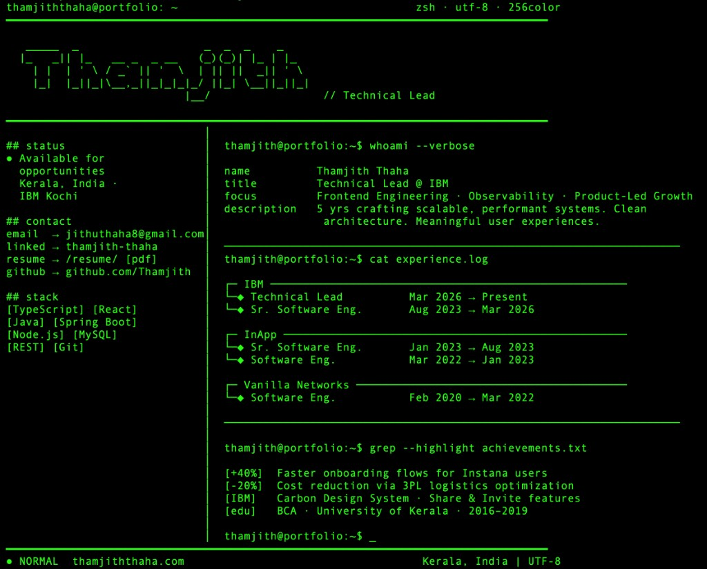

# portfolio

Live site: **[thamjiththaha.com](https://thamjiththaha.com)**

Open it in a **browser** for the full interactive portfolio. With **`curl`**, nginx serves the **terminal-style plain-text resume** (CLI user agents). Follow redirects if HTTP sends you to HTTPS:

```bash
curl -L https://thamjiththaha.com
```

| Browser | Terminal-style output (`curl`) |
| --- | --- |
|  |  |

## Before GitHub Actions

The workflow (`.github/workflows/build.yml`) runs on **pushes and pull requests** against `main`: it checks out the repo, runs `npm ci`, and `npm run build`. **Deploy to EC2 runs only on pushes to `main`** (after a successful build). Pull requests never deploy.

Do the following **before relying on deploy**, in order:

1. **GitHub:** Add the Actions secrets listed under [GitHub Secrets](#5-github-secrets). Without them, the deploy job fails immediately.
2. **EC2:** Ensure the SSH key you store in `EC2_SSH_KEY` matches a key authorized for **`EC2_USER`** on the instance, and that the host’s firewall / security group allows inbound SSH on **`EC2_SSH_PORT`** from GitHub-hosted runners (the public internet).
3. **EC2:** Create the deploy directory and give **`ubuntu`** ownership ([step 1](#1-create-web-root)). **`EC2_DEPLOY_PATH`** must match this directory exactly (absolute path, no stray spaces).
4. **EC2:** Install nginx and install the site config so it serves files from that directory ([step 2](#2-configure-nginx)).
5. **Optional but typical:** DNS pointed at the server and TLS via Certbot ([prerequisites](#prerequisites), [step 3](#3-certbot-and-ssl-certificate)).

Until steps 1–4 are done on the server and secrets are set in GitHub, the **deploy** job will fail even though **build** may pass. Step 5 is only needed when you want the live URL and HTTPS working.

## Server Setup

### Prerequisites
- Ubuntu server with nginx installed
- Domain DNS A records pointing to `18.210.59.148` (needed for HTTPS and a stable public URL—not required for rsync alone)
- **Deploy target directory:** GitHub Actions rsync needs `EC2_DEPLOY_PATH` to exist and be writable by **`ubuntu`** (`EC2_USER`); otherwise deploy fails. **Step 1 (Create web root)** does exactly that—run it once on the server before the first deploy to `main`.

### 1. Create web root

Rsync deploys over SSH as **`ubuntu`** (set **`EC2_USER`** to `ubuntu` in secrets). That user must own **`EC2_DEPLOY_PATH`** so it can create and replace files there.

```bash
sudo mkdir -p /var/www/thamjiththaha.com
sudo chown -R ubuntu:ubuntu /var/www/thamjiththaha.com
sudo chmod -R u+rwX /var/www/thamjiththaha.com
```

If the folder already existed with other ownership (e.g. `root` or `www-data`), the recursive `chown` fixes rsync “Permission denied”. Nginx still serves static files if files stay world-readable and directories traversable (`644` / `755`), which rsync’s defaults usually preserve.

### 2. Configure nginx

The checked-in `setup/nginx.conf` is **HTTP-only** (port 80) so `nginx -t` succeeds before certificates exist. After **step 3**, Certbot adds TLS (`ssl_certificate`, recommended SSL includes, and usually HTTPS redirect). Do not overwrite `/etc/nginx/sites-available/thamjiththaha.com` from this repo after Certbot unless you merge TLS blocks back in or run Certbot again.

```bash
sudo apt update && sudo apt install -y curl
sudo curl -fsSL https://raw.githubusercontent.com/Thamjith/portfolio/refs/heads/main/setup/nginx.conf -o /etc/nginx/sites-available/thamjiththaha.com

# Enable the site
sudo ln -s /etc/nginx/sites-available/thamjiththaha.com /etc/nginx/sites-enabled/thamjiththaha.com

# Test and reload
sudo nginx -t && sudo systemctl reload nginx
```

### 3. Certbot and SSL certificate

Install Certbot and the nginx plugin, then obtain and install certificates (Certbot edits nginx for HTTPS):

```bash
sudo apt update && sudo apt install -y certbot python3-certbot-nginx
sudo certbot --nginx -d thamjiththaha.com -d www.thamjiththaha.com
```

### 4. Allow nginx reload without password (optional)

The current deploy workflow only rsyncs files; nginx picks up new static assets without reload. Use this if you want **`ubuntu`** to reload nginx via `sudo systemctl reload nginx` without a password (for manual ops or a future workflow step):

```bash
echo "ubuntu ALL=(ALL) NOPASSWD: /bin/systemctl reload nginx" | sudo tee /etc/sudoers.d/nginx-reload
```

### 5. GitHub Secrets
Add these in **Settings → Secrets and variables → Actions**:

| Secret | Value |
|---|---|
| `EC2_HOST` | `18.210.59.148` |
| `EC2_USER` | `ubuntu` |
| `EC2_SSH_KEY` | Contents of your `.pem` private key file |
| `EC2_DEPLOY_PATH` | `/var/www/thamjiththaha.com` |
| `EC2_SSH_PORT` | `22` |

`EC2_DEPLOY_PATH` is not sensitive; you can store it as a **repository variable** instead of a secret so logs show the real path when debugging. If you keep it as a secret, GitHub masks it as `***`, including in rsync errors like `mkdir "***" failed: Permission denied`.

**That error usually means the path in `EC2_DEPLOY_PATH` is wrong, not that “files already exist”.** Typical cases: the secret is **empty** or only whitespace (rsync then targets `/` and cannot create directories); the value is **`/var/www`** instead of **`/var/www/thamjiththaha.com`** (as `ubuntu` you cannot create directories under `/var/www` when it is `root`-owned `755`); or the value has accidental **leading/trailing spaces or newlines** from pasting—delete and re-create the secret/variable.

### If deploy fails: rsync permission denied

On the server, confirm **`ubuntu`** owns `/var/www/thamjiththaha.com` (same as **`EC2_DEPLOY_PATH`**):

```bash
ls -ld /var/www /var/www/thamjiththaha.com
stat -c '%U %G' /var/www/thamjiththaha.com
```

For the site directory, `ls -ld` should show **`ubuntu`** **`ubuntu`** in the third and fourth columns; `stat` should print **`ubuntu ubuntu`**.

Then repair:

```bash
sudo chown -R ubuntu:ubuntu /var/www/thamjiththaha.com
sudo chmod -R u+rwX /var/www/thamjiththaha.com
```

Ensure the SSH private key is for the **`ubuntu`** account, not `root`.

### Static URL shows the homepage / `text/html`

`setup/nginx.conf` matches common **static extensions** (everything Vite emits from `public/` plus `/assets/*.js|css`, images, fonts, etc.) and uses **`try_files $uri =404`** so those paths never fall through to the SPA `index.html`. If you still see HTML for a file URL:

1. **On the server**, confirm the file exists after deploy (paths mirror `public/` at the site root): e.g. `ls -la /var/www/thamjiththaha.com/resume/` and `ls /var/www/thamjiththaha.com/*.svg`.
2. **Redeploy** (push to `main`) so `dist/` matches git—files under `public/` are copied into `dist/` by `vite build`.
3. **Reload nginx** after updating the config on the server (duplicate static-extension `location` into both `:80` and `:443` blocks if Certbot split them).
4. **Cloudflare / CDN:** Purge the affected URL (or prefix) after fixing the origin—stale cached HTML for an asset URL is common.

If you add **extensionless** files under `public/` later, extend that regex `location` or add a dedicated prefix `location`.

### 6. Updating nginx config later

If you already ran Certbot, the live file contains TLS settings Certbot added. Fetching this repo’s HTTP-only template **overwrites** those lines—either edit the server file manually to preserve HTTPS blocks or run `sudo certbot --nginx` again after replacing content. **Certificate-managed setups often duplicate logic on `:80` and `:443`; merge the static-extension `location` block into both server blocks if yours is split that way.**

```bash
sudo apt install -y curl
sudo curl -fsSL https://raw.githubusercontent.com/Thamjith/portfolio/refs/heads/main/setup/nginx.conf -o /etc/nginx/sites-available/thamjiththaha.com
sudo nginx -t && sudo systemctl reload nginx
```